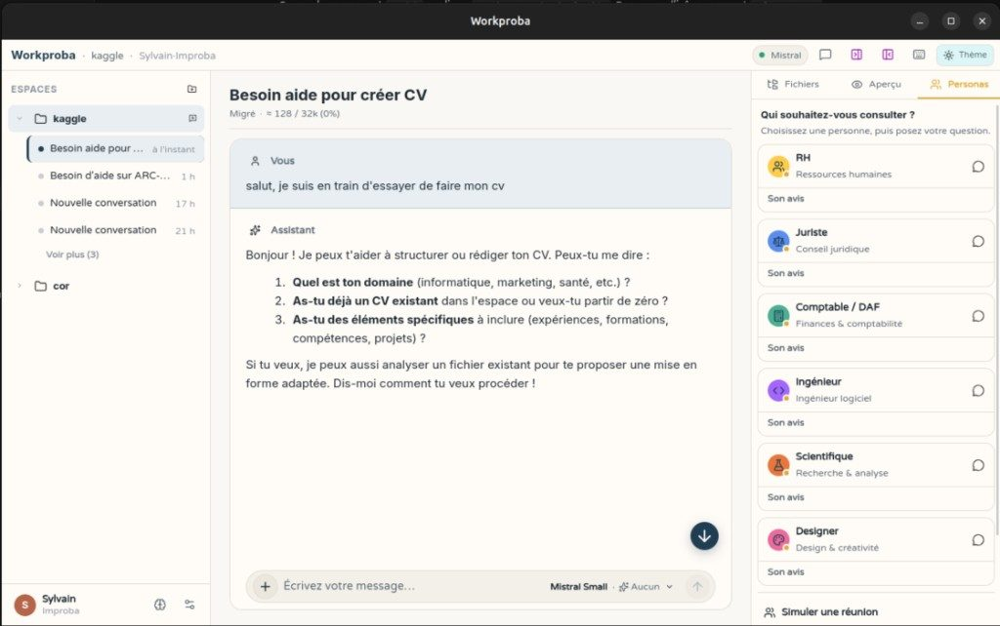
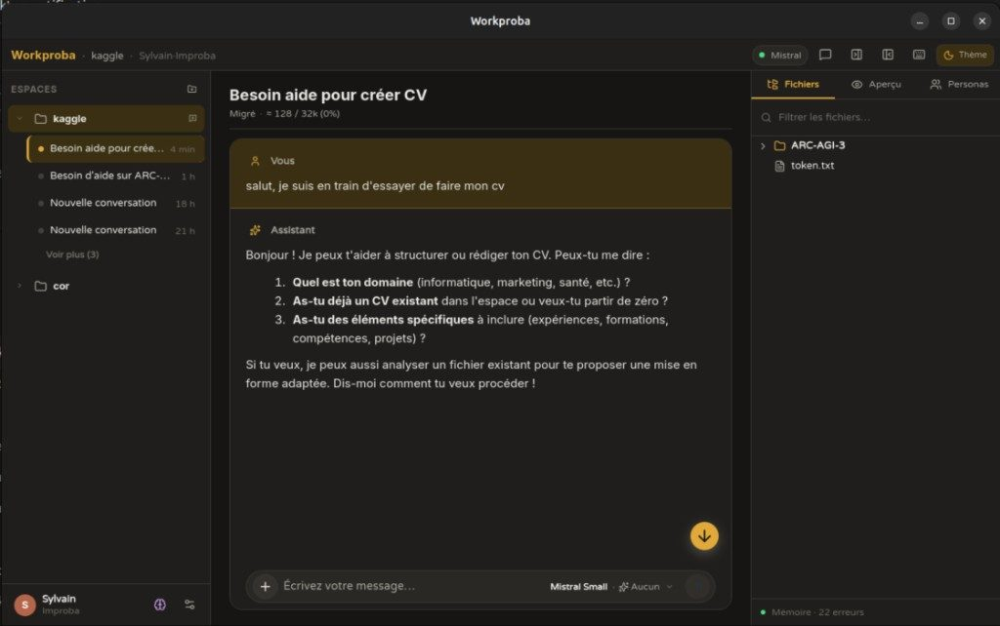

# Workproba

Notre conviction : l'IA ne devrait pas être un bouton de plus dans Word, Excel, Gmail ou un CRM. Elle devrait vivre comme une **interface personnelle** (ou professionnelle, mais centrée sur une personne) : une application bureau qui vous accompagne, connaît votre contexte, retient ce qui compte pour vous, et se **connecte** à vos dossiers et outils sans être enfermée dans l'un d'eux.

**Workproba** porte cette ambition. Assistant de travail **local-first** sur **macOS, Linux et Windows** (Tauri) : vous ouvrez un dossier projet, un agent manipule Word, Excel et PDF sur place, avec mémoire locale et sandbox technique sous le capot. Pensé pour des utilisateurs non-codeurs, dans le contexte Improba, sur le modèle d'un Claude Cowork maison.

*Local-first desktop AI cowork assistant. Tauri, RAG, Python sidecar, Vue/Quasar UI.*

## Aperçu

| Mode clair | Mode sombre |
|---|---|
|  |  |

## Fonctionnalités (V2)

- **Chat agent** : streaming SSE, modèle et raisonnement par conversation, pièces jointes, menu compositeur « + »
- **Mémoire scopée** : souvenirs utilisateur globaux + souvenirs projet, RAG local, outil agent `remember`
- **Plugin Personas** : avis métiers, réunions simulées, discussions (set Improba builtin)
- **Workspace** : sidebar workspaces/conversations, panneau droit (fichiers, aperçu, personas), side chat
- **Documents** : aperçu HTML/texte via sidecar, images via protocol-asset Tauri, versions avant écriture
- **Plugins** : projet, browser, cloud (extensibles, activables dans les réglages)

## Licence

Workproba est distribué sous **double licence** : usage personnel et éducatif gratuit ([WPEL](./LICENSE)), usage entreprise et institutionnel sur licence commerciale.

Voir [LICENSING.md](./LICENSING.md) pour le guide complet, la FAQ et les contacts.

## Première installation

Téléchargez l'installateur pour votre système (Windows, macOS ou Linux) sur la page **Releases** du dépôt. En V2, les installateurs ne sont pas encore signés numériquement : Windows et macOS affichent un avertissement au premier lancement. C'est normal.

Guide pas à pas (SmartScreen, Gatekeeper, `.deb`, AppImage, désinstallation) : **[docs/installateurs.md](./docs/installateurs.md)**.

## Documentation

- [docs/installateurs.md](./docs/installateurs.md) : installation (grand public)
- [docs/intention.md](./docs/intention.md) : cadrage produit
- [docs/desktop.md](./docs/desktop.md) : architecture bureau
- [docs/architecture.md](./docs/architecture.md) : vue technique
- [docs/memory.md](./docs/memory.md) : mémoire user/projet et RAG
- [docs/plugins.md](./docs/plugins.md) : plugins V2 (personas, projet, …)
- [docs/workspace-storage.md](./docs/workspace-storage.md) : stockage par workspace
- [docs/README.md](./docs/README.md) : index complet de la documentation
- [desktop/README.md](./desktop/README.md) : développement Tauri
- [services/ai/README.md](./services/ai/README.md) : API sidecar Python

## Structure

```
workproba/
├── desktop/          # Coque Tauri (produit)
├── front/            # UI Quasar (webview)
├── services/ai/      # Sidecar Python IA
├── docs/
├── scripts/
└── legacy/           # Ancien stack web (archivé, non utilisé)
```

## Démarrage

### Prérequis

- Rust ≥ 1.77, Node.js ≥ 22.22 (24 recommandé pour vitest 4 / build Quasar), Yarn
- Python 3.12 + uvicorn
- Dépendances OS Tauri : voir [desktop/README.md](./desktop/README.md)

### Développement

#### Une seule commande (recommandé)

Démarre le sidecar Python, attend qu'il soit sain (`/health`), puis lance Tauri qui démarre lui-même Quasar. Un seul `Ctrl+C` arrête proprement les deux.

```bash
make dev          # ou : yarn dev
```

Variantes :

```bash
make dev-ai       # sidecar Python seul
make dev-desktop  # Tauri seul (si sidecar déjà lancé ailleurs)
yarn dev:no-ai    # desktop sans (re)démarrer le sidecar
yarn dev:ai-only  # sidecar Python seul
```

Variables d'environnement utiles :

| Variable | Défaut | Rôle |
|---|---|---|
| `AI_PORT` | `8765` | Port du sidecar Python |
| `AI_HOST` | `127.0.0.1` | Host du sidecar |
| `HEALTH_TIMEOUT_S` | `30` | Délai max d'attente de `/health` |
| `AI_SKIP_WAIT` | `0` | `=1` pour ne pas attendre la santé du sidecar |

Logs du sidecar : `tail -f .dev-ai.log` à la racine.

#### Deux terminaux (méthode historique)

```bash
# Terminal 1 — sidecar Python (:8765)
make dev-ai

# Terminal 2 — Tauri + Quasar (:5053)
make dev-desktop
```

Ou : `bash scripts/dev.sh` puis `cd desktop && yarn dev`

### Build installateur

```bash
cd desktop && yarn build
```
