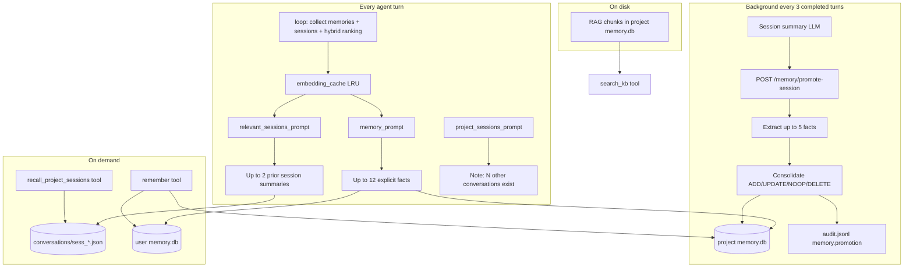

# Workproba memory

> **Last updated:** 14/07/2026

Workproba provides **local-first, scoped memory** for the desktop agent. Data stays on the user's machine (SQLite, JSON session files). No cloud memory service is required.

The system combines **three complementary layers**:

| Layer | Purpose | Persistence |
|---|---|---|
| **Project RAG** | Semantic search over folder documents | `memory.db` (project), vector chunks |
| **Explicit memories** | Short factual entries (user, agent, UI, auto-promotion) | `memory.db` (user + project) |
| **Cross-session recall** | Continuity across conversations in the same workspace | Session JSON summaries + agent tools |

Explicit memories use two **scopes** (`user`, `project`). RAG is **project-only**.

---

## Design principles

1. **Local-first**: all durable memory lives under `{app_data}`; the sidecar binds to loopback only.
2. **Scoped sharing**: user facts follow the person; project facts follow the workspace.
3. **Injection over tool calls**: the agent receives relevant context every turn without reading memory explicitly.
4. **Untrusted context**: injected memories and session extracts are wrapped in `<untrusted>` blocks with guardrail text (prompt-injection mitigation).
5. **Promotion, not dump**: cross-session continuity promotes **atomic facts**, not full transcripts, into project memory.
6. **Bounded growth**: project explicit memories are capped (LRU); compaction handles long **in-conversation** history separately.

---

## Architecture overview



---

## Scopes

| Scope | Range | SQLite file | Typical usage |
|---|---|---|---|
| `user` | Global, all workspaces | `{app_data}/user/memory.db` | Preferences, identity, habits |
| `project` | One workspace | `{workspace_data_dir}/memory.db` | Client facts, decisions, deliverables |

Paths:

- `{app_data}` = OS application folder (`~/.local/share/fr.improba.workproba/` on Linux, etc.).
- `{workspace_data_dir}` = `{app_data}/workspaces/{workspace_id}/.workproba/`.

Resolution: `services/ai/app/memory_stores.py`.

---

## RAG vs explicit memories

On **project** scope, both live in the same `memory.db`:

| Kind | Source | Retrieval |
|---|---|---|
| **RAG chunks** | `/agent/index-workspace`, agent `read_document` | Vector search (sqlite-vec) or substring fallback |
| **Explicit memories** | UI, `remember`, `/memory/add`, session promotion | Injected via `memory_prompt`; searchable via `/memory/search` |

On **user** scope: explicit memories only (no folder RAG).

### Memory sources (`source` field)

| Value | Origin |
|---|---|
| `manual` | Memory panel or `POST /memory/add` |
| `agent` | Agent `remember` tool |
| `session_promotion` | Automatic promotion from session summary |

Promoted entries include tags: `session:{session_id}`, `promoted`.

---

## Per-turn agent injection

Each turn, `AgentLoop` (`services/ai/app/agent/loop.py`) prepares context **once** before the agent runs:

1. Load explicit memories (`collect_tagged_memories`) → `prepared_tagged_memories` on `ToolContext` (avoids a second SQLite read in `memory_prompt`).
2. Build session digests, filter already-promoted sessions → `prepared_session_candidates`.
3. If semantic ranking is enabled and an embedding model is configured, compute hybrid ranking vectors via `prepare_ranking_for_turn` (with LRU cache; see below).

Dynamic system-prompt hooks in `services/ai/app/agent/tools.py`:

### `memory_prompt`

Injects explicit user + project memories each turn:

1. Reuse `prepared_tagged_memories` when set; otherwise load both scopes and deduplicate by normalized content.
2. Always include the **3** most recent entries (`MEMORY_PROMPT_RECENT_FLOOR`).
3. Rank remaining slots by **hybrid score** (semantic cosine + lexical overlap) with the current user message (`last_user_query`) when embeddings are available; otherwise lexical only.
4. Skip ranked entries with **zero lexical overlap and** insufficient semantic score when the query is non-empty.
5. Cap total at **12** entries (`MEMORY_PROMPT_TOPK`, max 64).

Content is wrapped in `<untrusted>` with i18n guardrail headers.

### `relevant_sessions_prompt`

Proactively injects up to **2** summaries of **other** conversations in the same workspace when:

- the current user message overlaps the session title/summary (lexically and/or semantically via hybrid ranking);
- the session has **not** yet been promoted (no `session:{id}` tag in project memory);
- `prepared_session_candidates` from the turn prep is reused when available (no second digest read).

This bridges the gap before the next promotion cycle. Once facts are promoted, this hook defers to `memory_prompt`.

### `project_sessions_prompt`

Lightweight note: « this space has N other conversation(s) ». Points the agent to `recall_project_sessions` for targeted lookup.

### Agent tools

| Tool | Role |
|---|---|
| `remember(content, scope="user"\|"project")` | Persist a fact; uses heuristic consolidation (no LLM) |
| `recall_project_sessions(query?)` | List other sessions with title + summary (max 20) |
| `search_kb(query)` | Project RAG + substring memory search |

---

## Semantic hybrid ranking (explicit memories + sessions)

> **Status: shipped (14/07/2026).** Enabled by default when an embedding model is configured (`provider_set.embeddings` or `LLM_EMBEDDING_*`).

Explicit memory injection and proactive session recall use a **hybrid ranker** (`app/agent/memory_ranking.py`):

| Signal | Weight (default) | Role |
|---|---|---|
| Cosine similarity (query ↔ memory/session text) | 0.6 (`MEMORY_RANKING_SEMANTIC_WEIGHT`) | Finds paraphrases and related wording |
| Lexical token overlap | 0.4 (complement) | Stable fallback, exact-term matches |

Implementation:

- `app/agent/memory_embeddings.py`: resolves embedding credentials, batches texts, calls cache.
- `app/agent/embedding_cache.py`: LRU cache keyed by **`model + base_url + SHA256(text)`**; only cache misses hit LiteLLM.
- `app/agent/loop.py`: precomputes vectors once per turn; passes them via `ToolContext` (`memory_query_embedding`, `memory_item_embeddings`, `session_item_embeddings`).

### Long conversations (cache behaviour)

On a typical multi-turn chat **without memory changes**:

| Turn | Embeddings computed |
|---|---|
| 1 | Query + all explicit memories + all candidate sessions |
| 2+ | **Query only** (memories/sessions served from cache) |

When a new fact is added (`remember`, promotion, UI add), only the **new or changed text** is embedded. Content-hash keys auto-invalidate when wording changes.

Cache is **process-local** (in-memory LRU, default 4096 entries). It does not survive a sidecar restart; a future persistence layer is optional.

Disable semantic ranking: `MEMORY_RANKING_SEMANTIC_ENABLED=false` (falls back to lexical ranking only; no embedding calls for injection).

---

## Inter-conversational promotion

> **Status: shipped (14/07/2026).** Full pipeline on sidecar + front. Still open: clickable citations in chat (T-V2-18).

### Trigger (frontend)

In `ChatPage.vue`, every **3 completed turns** (minimum 4 messages):

1. Regenerate a concise session summary via `POST /util/summarize`.
2. Persist it on the session JSON (`summary` field).
3. Call `POST /memory/promote-session` silently in the background.

Failures are ignored (non-blocking).

### Pipeline (sidecar)

Implementation: `services/ai/app/agent/memory_consolidation.py`.

```
Session summary
    → extract_facts_from_summary (utility LLM, max 5 JSON facts)
    → consolidate_facts (per fact)
    → trim_project_memory_store (LRU cap)
    → log_promotion_event (audit + app log)
```

### Consolidation algorithm

For each extracted fact, compare against existing project memories using **Jaccard token overlap**:

| Condition | Operation |
|---|---|
| Normalized content identical | **NOOP** |
| Overlap ≥ `MEMORY_PROMOTION_OVERLAP_THRESHOLD` (0.55) | **UPDATE** candidate |
| Overlap below threshold | **ADD** |

For every **UPDATE** candidate (when `MEMORY_PROMOTION_CONTRADICTION_ENABLED`):

1. Utility LLM returns `{"action":"UPDATE"|"DELETE"|"NOOP"}`.
2. **UPDATE**: replace content in place (same `memory_id`, refreshes `created_at`).
3. **DELETE**: remove conflicting memory, add new fact (contradiction).
4. **NOOP**: keep existing entry.
5. On LLM failure: fallback to **UPDATE**.

When contradiction checks are disabled, UPDATE candidates are applied directly.

### Heuristic writes (no LLM)

`remember`, `POST /memory/add`, and the Memory panel use `apply_explicit_memory_heuristic`:

- exact duplicate → NOOP (return existing);
- high overlap → UPDATE in place;
- otherwise → ADD.

Same overlap threshold as promotion (`MEMORY_PROMOTION_OVERLAP_THRESHOLD`).

---

## In-conversation compaction (not long-term memory)

Separate mechanism in `services/ai/app/agent/compaction.py`:

- Triggers when estimated history + memory overhead exceeds ~70% of the context window.
- Summarizes old messages inside **the current conversation** via utility LLM.
- Does **not** write to `memory.db`.

Memory overhead for compaction estimates uses at most `MEMORY_PROMPT_TOPK` entries (`estimate_memory_overhead`).

---

## Project memory cap (LRU)

Default: **200** explicit project entries (`MEMORY_PROJECT_MAX_ENTRIES`).

After promotion, manual add, or `remember` on project scope:

- list memories by `created_at` descending (newest first);
- delete oldest entries beyond the cap.

RAG chunks are **not** affected by this cap.

User scope has no automatic cap.

---

## Session summaries

Stored in `conversations/sess_*.json`:

| Field | Role |
|---|---|
| `summary` | Auto-generated cross-session digest (optional) |
| `updatedAt` | Used to sort sessions in `recall_project_sessions` |

If `summary` is missing, `build_session_digests` falls back to first user message + last assistant reply extract.

See [workspace-storage.md](./workspace-storage.md).

---

## Security

- All injected memory and session extracts use `wrap_untrusted_content` (`app/agent/untrusted.py`).
- Guardrail text tells the model to treat injected content as **data**, not instructions.
- Sidecar memory routes require `X-Internal-Secret` on loopback.

---

## Observability

Each successful promotion (at least one extracted fact) appends an audit event:

| Field | Value |
|---|---|
| Event | `memory.promotion` |
| Actor | `system` |
| Details | `session_id`, `counts`, `facts_extracted`, `pruned` |

Also logged at INFO level in the sidecar.

---

## REST API (sidecar)

All routes require `X-Internal-Secret` (loopback only).

| Method | Route | Role |
|---|---|---|
| GET | `/memory/items?workspace_data_dir=&memory_scope=user\|project` | List explicit memories |
| GET | `/memory/search?query=&memory_scope=user\|project\|all` | Search (project = RAG + explicit; user = explicit only) |
| POST | `/memory/add` | Manual add with heuristic consolidation |
| POST | `/memory/promote-session` | Promote session summary → project memory |
| POST | `/memory/forget` | Delete by `memory_id` |
| DELETE | `/memory` | Wipe (`scope`: `all` / `memories` / `conversations`; `confirmed: true`) |

### `POST /memory/promote-session`

Request body:

```json
{
  "workspace_data_dir": "/path/to/.workproba",
  "session_id": "sess_…",
  "summary": "Structured session summary text",
  "llm_provider_config": null,
  "utility_llm_config": null,
  "locale": "fr"
}
```

Response:

```json
{
  "session_id": "sess_…",
  "facts": ["Fact one.", "Fact two."],
  "results": [{"operation": "ADD", "memory": { "…" }}],
  "counts": {"ADD": 1, "UPDATE": 0, "NOOP": 0, "DELETE": 0},
  "pruned": 0
}
```

Front-end client: `front/src/services/aiSidecar.ts` (`promoteSessionMemory`, `useMemory.ts`).

---

## Configuration (environment)

| Variable | Default | Role |
|---|---|---|
| `MEMORY_PROMPT_TOPK` | 12 | Max memories injected per turn |
| `MEMORY_PROMPT_RECENT_FLOOR` | 3 | Always-included recent memories |
| `MEMORY_PROMOTION_MAX_FACTS` | 5 | Facts extracted per promotion |
| `MEMORY_PROMOTION_OVERLAP_THRESHOLD` | 0.55 | Min Jaccard for UPDATE candidate |
| `MEMORY_PROMOTION_CONTRADICTION_ENABLED` | true | LLM check on every UPDATE candidate |
| `MEMORY_PROACTIVE_SESSIONS_TOPK` | 2 | Prior sessions injected per turn |
| `MEMORY_PROACTIVE_SESSIONS_MIN_OVERLAP` | 2 | Min token overlap (capped by query length) |
| `MEMORY_PROJECT_MAX_ENTRIES` | 200 | Project explicit memory LRU cap |
| `MEMORY_RANKING_SEMANTIC_ENABLED` | true | Hybrid semantic + lexical ranking for injection |
| `MEMORY_RANKING_SEMANTIC_WEIGHT` | 0.6 | Weight of cosine similarity in hybrid score |
| `MEMORY_RANKING_MIN_SEMANTIC_SCORE` | 0.25 | Min cosine to rank without lexical overlap |
| `MEMORY_RANKING_EMBEDDING_TIMEOUT_S` | 15 | Timeout (seconds) for embedding batch per turn |
| `MEMORY_EMBEDDING_CACHE_MAX_ENTRIES` | 4096 | LRU cache size (model + endpoint + text hash) |

---

## Source code map

| Module | Role |
|---|---|
| `app/memory_stores.py` | Scope → SQLite path |
| `app/rag/store.py` | `RagStore`, explicit memories, RAG, LRU trim |
| `app/agent/memory_consolidation.py` | Promotion pipeline, consolidation, audit |
| `app/agent/memory_ranking.py` | Hybrid + lexical ranking for memories and sessions |
| `app/agent/memory_embeddings.py` | Per-turn embedding prep, provider resolution |
| `app/agent/embedding_cache.py` | LRU cache + batched `embed_texts_cached` |
| `app/agent/loop.py` | Turn prep: memories, sessions, ranking context |
| `app/agent/tools.py` | Agent hooks + `remember` + `recall_project_sessions` |
| `app/agent/compaction.py` | In-conversation history summarization |
| `app/agent/untrusted.py` | `<untrusted>` wrapping |
| `app/main.py` | Memory REST routes |
| `front/src/pages/chat/ChatPage.vue` | Auto summary + promotion trigger |
| `front/src/components/memory/MemoryPanel.vue` | Memory UI |

---

## Tests

| File | Coverage |
|---|---|
| `test_memory_scope.py` | User vs project isolation |
| `test_memory_extended.py` | CRUD, search, clear |
| `test_memory_prompt.py` | Injection, guardrails, scopes |
| `test_memory_consolidation.py` | ADD/UPDATE/NOOP/DELETE, audit, trim |
| `test_memory_promotion.py` | `/memory/promote-session` HTTP |
| `test_memory_ranking.py` | Lexical ranking fallback |
| `test_memory_ranking_semantic.py` | Hybrid semantic ranking |
| `test_memory_embeddings.py` | Embedding prep, credentials, timeout |
| `test_embedding_cache.py` | LRU cache, long-conversation hits, dedup batch |
| `test_memory_mechanics.py` | Cross-hook behavior, dedup, session skip |
| `test_memory_flow.py` | End-to-end flow: promote → inject, session bridge, HTTP dedup |
| `test_agent_remember.py` | `remember` tool wiring |
| `test_recall_project_sessions.py` | Session digest builder |
| `test_compaction.py` | History compaction + memory overhead |

Run: `cd services/ai && uv run pytest tests/test_memory_*.py tests/test_embedding_cache.py tests/test_agent_remember.py tests/test_recall_project_sessions.py -q`

Front: `cd front && yarn vitest run test/unit/composables/useMemory.spec.ts test/unit/services/aiSidecar.spec.ts -t "memory|useMemory|promoteSession|forgetAll"`

---

## User interface

**Memory** panel (`MemoryPanel.vue`, sidebar brain icon):

- **User** / **Project** tabs;
- manual add (uses same heuristic consolidation as API);
- search in active scope;
- delete entry.

---

## Known limitations

| Limitation | Notes |
|---|---|
| Embedding cache not persisted | LRU is process-local; sidecar restart re-embeds once |
| Promotion latency | Facts appear in shared memory up to ~3 turns after they are discussed |
| User scope uncapped | Global memories grow until manual cleanup |
| Contradiction LLM cost | Up to one utility call per UPDATE candidate per promotion cycle |
| No cross-workspace RAG | Document index is per project workspace |
| No embedding model | Hybrid ranking disabled; lexical overlap only for injection |

Planned (roadmap): `memory_meta.json` for extracted metadata, **persistent embedding cache**, **UI citations in chat** (T-V2-18, personas opinion cards already show memory citations).

---

## See also

- [workspace-storage.md](./workspace-storage.md): on-disk layout, session schema
- [architecture.md](./architecture.md): system overview
- [services/ai/README.md](../services/ai/README.md): sidecar API catalog
