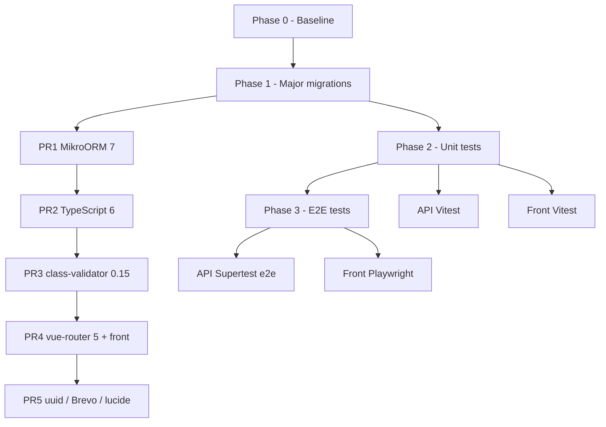

# Pre-Project Kickoff Plan (S1)

Reference document for preparing the Glutamat base **before the business project starts** (week 1).

**Working branch:** `feature/update-package`, all work (migrations, tests, CI) happens on this branch until the final merge.

**Starting point (already done on the branch):**

- Security update + patch/minor (`yarn audit` = 0 on api and front)
- Commits: security/resolutions, then compatible patch/minor

**Final goal:** up-to-date major stack, operational unit tests, e2e skeleton, documentation and minimal CI.

### Documentation (MD files)

| File | Role | Up to date |
|---------|------|--------|
| [plan-pre-s1.md](./plan-pre-s1.md) | Plan + checkboxes | Yes |
| [stack.md](./stack.md) | Versions + accepted gaps | Yes |
| [testing.md](./testing.md) | Vitest, commands, spec inventory | Yes |
| [README.md](./README.md) (docs/) | Doc index | Yes |
| [README.md](../README.md) (root) | Setup + **How to test** | Yes |
| [api/test/README.md](../api/test/README.md) | Pointer to `docs/testing.md` | Yes |

Remaining `[ ]` checkboxes in this plan describe **technical or manual work** still to do, not MD writing.

---

## Current state

*Last verified: 26/05/2026, branch `feature/update-package` (API Vitest migration validated).*

| Area | Situation |
|------|-----------|
| **Dependencies** | Audit 0; MikroORM 7, TS 6, class-validator 0.15, vue-router 5 in place; **1.5** (uuid 14, Brevo 5, inquirer 13) not done |
| **API, tests** | **Vitest**, `test:unit*` and `test:e2e*` scripts in `api/package.json` |
| **API, e2e** | Vitest e2e operational (`test/e2e/`); isolated run via `yarn test:e2e` |
| **Front, tests** | **Vitest**, 3 files, **7 tests** passing |
| **CI** | `.github/workflows/desktop-ci.yml` + `desktop-release.yml` (desktop); legacy `ci.yml` removed |
| **`lib-improba`** | Code copied api + front; no npm package |

---

## Phase overview



**Rule:** after each block, validate `yarn build`, `yarn test:unit` + `yarn test:e2e` (api), `yarn audit`, Docker smoke.

**Commits:** atomic commits on `feature/update-package` (no child branches needed unless team preference).

---

## Phase 0, Baseline

**Indicative duration:** ½ day

- [x] Verify that branch `feature/update-package` is up to date and clean
- [x] Create `docs/stack.md` (frozen target versions)
- [ ] Manual smoke:
  - [ ] `sh compose.sh up` → API + front + DB
  - [ ] Migrations if first install (see [README](../README.md))
  - [ ] Login / minimal admin navigation
- [x] API tests via Docker (`docker-compose.test.yml`, 37 tests)
- [x] `yarn build` api + front (local, May 2026)

**Deliverable:** documented baseline, ready for majors.

---

## Phase 1, Major migrations

**Indicative duration:** 2–4 days  
**Mandatory order** (each step can be one or more commits on `feature/update-package`).

### 1.1, MikroORM 6 → 7 (+ `@mikro-orm/nestjs` 7)

**Impact:** widest, `api/lib-improba/base/*`, `config/mikro-orm.config.ts`, migrations, DB tests.

- [x] Read the [MikroORM 6 → 7 migration guide](https://mikro-orm.io/docs/upgrading-v6-to-v7)
- [x] Bump **all** `@mikro-orm/*` deps to **7.x** (aligned versions)
- [x] Bump `@mikro-orm/nestjs` to **7.x**
- [x] Adapt `api/config/mikro-orm.config.ts`, `migrations.config.ts`, `api/test/config/database.config.ts`
- [ ] Validate migrations on empty DB (`migration:fresh` in dev if acceptable)
- [x] Fix `api/lib-improba` if base/repository API changes
- [x] `yarn build` OK
- [x] Tests migrated to **Vitest** (MikroORM 7 = ESM; Jest requires Node ≥ 24.9)
- [x] API tests green with DB via Docker (`api/docker/docker-compose.test.yml`, **37 tests**)
- [ ] Docker dev smoke

**Success criterion:** app starts, migrations OK, existing tests green.

---

### 1.2, TypeScript 5.9 → 6 (api + front)

**Impact:** cross-cutting (Nest, Quasar, `vue-tsc`, ESLint).

- [x] Bump `typescript` in `api/package.json` and `front/package.json`
- [x] `ignoreDeprecations: "6.0"` in `tsconfig` (baseUrl deprecated)
- [x] `yarn build` api + front
- [x] `yarn audit` = 0

**Note:** if a tool blocks, document the exception in `docs/stack.md`.

---

### 1.3, class-validator 0.14 → 0.15

**Impact:** DTOs / pipes, `api/lib-improba`, `api/src/core/users`, auth-jwt.

- [x] Bump `class-validator` ^0.15.0
- [x] `yarn build` + Docker tests (37/37)

---

### 1.4, Front: vue-router 5 + optional satellites

**Impact:** `front/src/router/*`, `front/lib-improba/composables/use-auth/router.ts`, query params.

- [x] Bump `vue-router` ^5.0.0 (no breaking change without file-based routing)
- [x] `yarn build` front OK
- [ ] Manual smoke: login, admin, navigation
- [ ] Optional: `lucide-vue-next` 1.x, `dotenv` 17

---

### 1.5, Small isolated API majors

| Package | Action |
|---------|--------|
| **uuid 14** | [ ] Remains on **11.x**; `v4` in `user-jwt.service.ts`, bump if needed |
| **@getbrevo/brevo 5** | [ ] Not used in current TS code (dep only), optional |
| **inquirer 13** | [ ] Test `yarn generator` |

**Do not modify** (unless explicit decision) security `resolutions` (`minimatch` 9, `path-to-regexp` 0.1 on front, etc.), "latest" in `yarn outdated` is misleading.

---

### Majors intentionally out of scope (or documented deferral)

| Package | Reason |
|---------|--------|
| MikroORM 7 | Done in 1.1, if deferred, document in `docs/stack.md` |
| TypeScript 6 | Done in 1.2 |
| `minimatch` 10, `file-type` 22, `jws` 4 via resolutions | Audit risk / express regression |

**End of Phase 1:** `yarn outdated` only shows **accepted** gaps listed in `docs/stack.md`.

---

## Phase 2, Unit tests

**Indicative duration:** 1.5–2 days  
**Goal:** safety net before S1 business code.

### 2.1, API: Vitest (replaces Jest for MikroORM 7 ESM)

**In place:** Vitest + `unplugin-swc`, `api/vitest.config.ts`, monorepo aliases aligned, `supertest` imports fixed for ESM; separate unit/e2e scripts in place (`test:unit*`, `test:e2e*`).

| Task | Detail |
|-------|--------|
| [x] Doc | [testing.md](./testing.md) aligned Vitest + e2e |
| Convention | `api/test/unit/` = mocked unit (flat); `api/test/e2e/` = e2e |
| [x] Pipe specs | `ParseFilter`, `ParseIntOrUndefined` |
| Priority specs | `lib-improba/base`, `src/core/users` |
| Target coverage | ~60–70% on `lib-improba` + `src/core` (not 100% before S1) |

**Specs to add (suggested order):**

1. `user.service.spec.ts` (EntityManager mocks)
2. `base.repository.spec.ts` (pagination / soft delete if applicable)
3. [x] `ParseFilter.pipe.spec.ts` (pure unit, no DB)

**Commands:**

```bash
cd api && yarn test:unit
cd api && yarn test:unit:cov
cd api && yarn test:e2e                # e2e only (DB required)
cd .. && make unit-test                # front + api unit tests in Docker
```

---

### 2.2, Front: Vitest + Vue Test Utils

**Target stack:**

- `vitest`
- `@vue/test-utils`
- `happy-dom` or `jsdom`
- Config alias identical to Vite (`@lib-improba`, `~`, etc.)

| Task | Detail |
|-------|--------|
| Scripts | [x] `vitest run` / `vitest watch` |
| Config | [x] `front/vitest.config.ts` |
| First test | [x] `pagination-filters.utils.spec.ts` |
| Quasar/i18n setup | [x] `front/test/setup.ts` |
| Suite | [x] `use-auth`, Mastok components |

**Criterion:** `cd front && yarn test:all`, at least 5 tests green (**7/5** ✓).

---

### 2.3, Minimal CI

Create `.github/workflows/ci.yml`:

```yaml
# Target structure
jobs:
  api:
    - checkout
    - yarn install (api)
    - yarn build
    - postgres service
    - yarn test
  front:
    - checkout
    - yarn install (front)
    - yarn build
    - yarn test
```

- [x] `.github/workflows/ci.yml` file (api + front, Postgres service)
- [ ] Green CI on push to `feature/update-package`
- [x] Option: also trigger on `develop` after merge (already configured)

---

## Phase 3, E2E tests (second pass)

**Indicative duration:** 2–3 days  
**Prerequisites:** Phase 1 and 2 stable.

### 3.1, API e2e (Supertest + Vitest)

| Task | Detail |
|-------|--------|
| [x] `api/test/e2e/` folder | `app.e2e-spec.ts`, `auth-jwt.e2e-spec.ts` |
| [x] Script | `yarn test:e2e` |
| [ ] Protected route 401/200 | JWT guard on full module |
| Docker | Extend `docker-compose.test.yml` if needed |

**Distinction:**

| Type | Tool | Example |
|------|-------|---------|
| Unit | Vitest | Pipe, util, mocked service |
| Integration | Vitest + MikroORM + DB | `user-jwt.service`, current controller spec |
| API E2E | Vitest + Supertest | End-to-end HTTP |

---

### 3.2, Front e2e (Playwright)

| Task | Detail |
|-------|--------|
| Dependency | `@playwright/test` |
| Config | `front/playwright.config.ts` |
| Specs | `front/e2e/auth.spec.ts`, `front/e2e/admin-users.spec.ts` (optional) |
| Prerequisites | API + front + DB (`compose.sh up`) or Playwright `webServer` |

**Minimum S1 scenarios:**

1. Login page displayed
2. Login → redirect to admin area
3. (Optional) Users list visible

---

## Test type matrix

| Level | API | Front |
|--------|-----|-------|
| Unit | Vitest | Vitest |
| Integration | Vitest + DB | (none) |
| E2E | Supertest + Vitest | Playwright |

Documentation: [testing.md](./testing.md) (Vitest api + front).

---

## Indicative schedule

| Day | Focus |
|------|--------|
| D1 | Phase 0 + MikroORM 7 |
| D2 | TypeScript 6 + class-validator |
| D3 | vue-router 5 + uuid/Brevo + Docker smoke |
| D4 | API unit tests + start Vitest |
| D5 | Finish Vitest + CI + doc updates |
| D6–D7 | API E2E then Playwright (if time allows) |

**If short on time:** prioritize MikroORM 7 + TS 6 + API unit tests; defer Playwright to S1 start (keep at minimum API auth e2e).

---

## Definition of Done (global)

| Criterion | Status |
|---------|--------|
| MikroORM 7, TypeScript 6, vue-router 5 | [x], see [stack.md](./stack.md) |
| `yarn audit` = 0 (api + front) | [x] verified locally |
| `yarn build` OK (api + front) | [x] verified locally |
| api: unit/e2e tests (Docker) | [x] 94/94 |
| api: e2e (`yarn test:e2e`) | [x] 3/3 in API container (`app.e2e` + `auth-jwt.e2e`) |
| front: `yarn test:all` (Vitest) | [x] 7 tests (5 target met; Quasar components not yet) |
| ~60–70% coverage lib-improba + core | [ ] not measured / insufficient |
| front: Playwright login smoke | [ ] Phase 3.2 |
| docs/stack.md, testing.md | [x] testing.md up to date; stack.md basic |
| Green CI on remote | [ ] after push |
| Smoke `compose.sh up` + admin login | [ ] manual |
| README "How to test" section | [x] [README.md](../README.md) |

---

## Risks

1. **MikroORM 7**, migration surprises → empty DB + `migration:fresh` in dev acceptable before S1.
2. **Vitest parallel + DB**, keep `truncate` / `generateUniqueId`; reduce `maxWorkers` if flaky.
3. **Front with no test history**, target **patterns**, not 80% coverage.
4. **Flaky E2E**, few scenarios, fixed seed account, no time dependency.

---

## Next step

**Ready for S1 on the stack side** (core majors + mocked API tests). Before merging to `develop`:

1. Push → validate **green CI** (align CI scripts with `package.json` if needed).
2. Keep e2e in containerized run (Docker DB) with `yarn test:e2e`.
3. Manual smoke: `compose.sh up`, login/admin.
4. Optional before S1: `migration:fresh`, uuid 14, Playwright login, `base.repository` / `user.service` specs.

**Not blocking S1:** Brevo 5, lucide/dotenv, 60% coverage, protected JWT route e2e.
