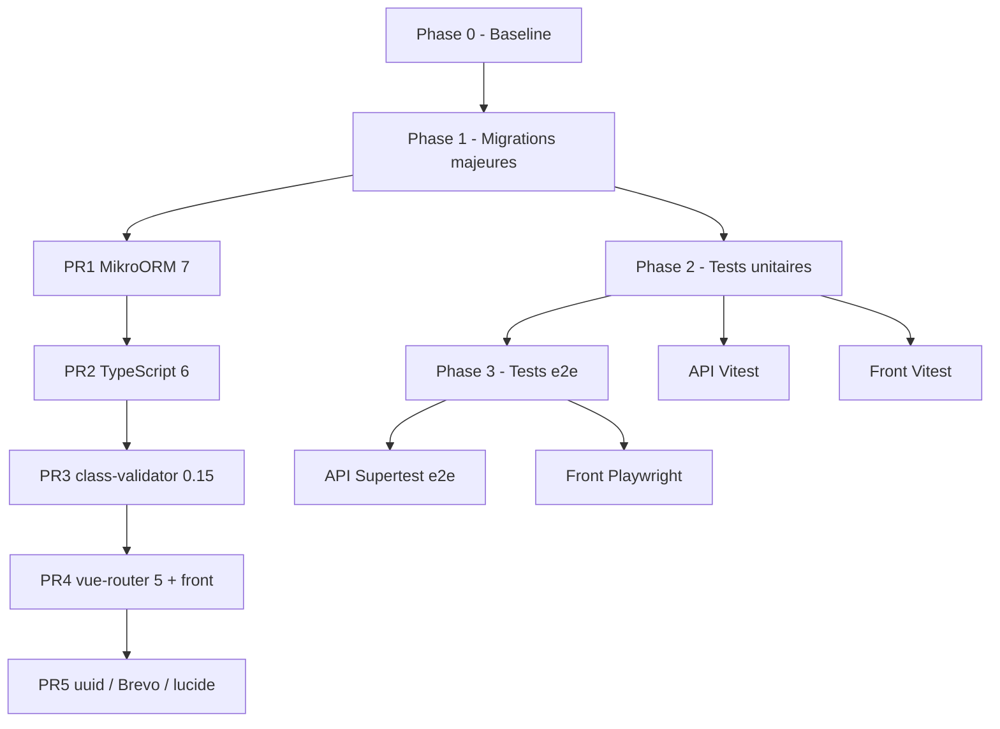

# Plan pré-démarrage projet (S1)

Document de référence pour préparer la base Glutamat **avant le début du projet métier** (semaine 1).

**Branche de travail :** `feature/update-package` — tout le chantier (migrations, tests, CI) se fait sur cette branche jusqu’au merge final.

**État au point de départ (déjà fait sur la branche) :**

- Mise à jour sécurité + patch/minor (`yarn audit` = 0 sur api et front)
- Commits : sécurité/résolutions, puis patch/minor compatibles

**Objectif final :** stack majors à jour, tests unitaires opérationnels, squelette e2e, documentation et CI minimale.

### Documentation (fichiers MD)

| Fichier | Rôle | À jour |
|---------|------|--------|
| [plan-pre-s1.md](./plan-pre-s1.md) | Plan + cases à cocher | Oui |
| [stack.md](./stack.md) | Versions + écarts assumés | Oui |
| [testing.md](./testing.md) | Vitest, commandes, inventaire specs | Oui |
| [README.md](./README.md) (docs/) | Index doc | Oui |
| [README.md](../README.md) (racine) | Setup + **Comment tester** | Oui |
| [api/test/README.md](../api/test/README.md) | Renvoi vers `docs/testing.md` | Oui |

Les cases `[ ]` restantes dans ce plan décrivent du **travail technique ou manuel** encore à faire, pas de la rédaction MD.

---

## État des lieux

*Dernière vérification : 26/05/2026 — branche `feature/update-package` (migration Vitest API validée).*

| Zone | Situation |
|------|-----------|
| **Dépendances** | Audit 0 ; MikroORM 7, TS 6, class-validator 0.15, vue-router 5 en place ; **1.5** (uuid 14, Brevo 5, inquirer 13) non fait |
| **API — tests** | **Vitest** — scripts `test:unit*` et `test:e2e*` dans `api/package.json` |
| **API — e2e** | Vitest e2e opérationnels (`test/e2e/`) ; exécution isolée via `yarn test:e2e` |
| **Front — tests** | **Vitest** — 3 fichiers, **7 tests** verts |
| **CI** | `.github/workflows/ci.yml` présent ; **non validé** tant que la branche n’est pas poussée |
| **`lib-improba`** | Code copié api + front ; pas de package npm |

---

## Vue d’ensemble des phases



**Règle :** après chaque bloc, valider `yarn build`, `yarn test:unit` + `yarn test:e2e` (api), `yarn audit`, smoke Docker.

**Commits :** commits atomiques sur `feature/update-package` (pas besoin de branches filles sauf préférence équipe).

---

## Phase 0 — Baseline

**Durée indicative :** ½ journée

- [x] Vérifier que la branche `feature/update-package` est à jour et propre
- [x] Créer `docs/stack.md` (versions cibles figées)
- [ ] Smoke manuel :
  - [ ] `sh compose.sh up` → API + front + DB
  - [ ] Migrations si première install (voir [README](../README.md))
  - [ ] Login / navigation admin minimale
- [x] Tests api via Docker (`docker-compose.test.yml` — 37 tests)
- [x] `yarn build` api + front (local, mai 2026)

**Livrable :** baseline documentée, prête pour les majors.

---

## Phase 1 — Migrations majeures

**Durée indicative :** 2–4 jours  
**Ordre obligatoire** (chaque étape peut être un ou plusieurs commits sur `feature/update-package`).

### 1.1 — MikroORM 6 → 7 (+ `@mikro-orm/nestjs` 7)

**Impact :** le plus large — `api/lib-improba/base/*`, `config/mikro-orm.config.ts`, migrations, tests DB.

- [x] Lire le [guide de migration MikroORM 6 → 7](https://mikro-orm.io/docs/upgrading-v6-to-v7)
- [x] Monter **toutes** les deps `@mikro-orm/*` en **7.x** (versions alignées)
- [x] Monter `@mikro-orm/nestjs` en **7.x**
- [x] Adapter `api/config/mikro-orm.config.ts`, `migrations.config.ts`, `api/test/config/database.config.ts`
- [ ] Valider migrations sur DB vide (`migration:fresh` en dev si acceptable)
- [x] Corriger `api/lib-improba` si l’API base/repository change
- [x] `yarn build` OK
- [x] Tests migrés vers **Vitest** (MikroORM 7 = ESM ; Jest nécessite Node ≥ 24.9)
- [x] Tests api verts avec DB via Docker (`api/docker/docker-compose.test.yml` — **37 tests**)
- [ ] Smoke Docker dev

**Critère de succès :** app démarre, migrations OK, tests existants verts.

---

### 1.2 — TypeScript 5.9 → 6 (api + front)

**Impact :** transverse (Nest, Quasar, `vue-tsc`, ESLint).

- [x] Monter `typescript` dans `api/package.json` et `front/package.json`
- [x] `ignoreDeprecations: "6.0"` dans les `tsconfig` (baseUrl déprécié)
- [x] `yarn build` api + front
- [x] `yarn audit` = 0

**Note :** si un outil bloque, documenter l’exception dans `docs/stack.md`.

---

### 1.3 — class-validator 0.14 → 0.15

**Impact :** DTOs / pipes — `api/lib-improba`, `api/src/core/users`, auth-jwt.

- [x] Monter `class-validator` ^0.15.0
- [x] `yarn build` + tests Docker (37/37)

---

### 1.4 — Front : vue-router 5 + satellites optionnels

**Impact :** `front/src/router/*`, `front/lib-improba/composables/use-auth/router.ts`, query params.

- [x] Monter `vue-router` ^5.0.0 (pas de breaking change sans file-based routing)
- [x] `yarn build` front OK
- [ ] Smoke manuel : login, admin, navigation
- [ ] Optionnel : `lucide-vue-next` 1.x, `dotenv` 17

---

### 1.5 — Petites majors API isolées

| Package | Action |
|---------|--------|
| **uuid 14** | [ ] Reste en **11.x** ; `v4` dans `user-jwt.service.ts` — à monter si besoin |
| **@getbrevo/brevo 5** | [ ] Non utilisé dans le code TS actuellement (dep seulement) — optionnel |
| **inquirer 13** | [ ] Tester `yarn generator` |

**Ne pas modifier** (sauf décision explicite) les `resolutions` de sécurité (`minimatch` 9, `path-to-regexp` 0.1 côté front, etc.) — les « latest » dans `yarn outdated` sont trompeurs.

---

### Majors volontairement hors scope (ou report documenté)

| Package | Raison |
|---------|--------|
| MikroORM 7 | Fait en 1.1 — si report, documenter dans `docs/stack.md` |
| TypeScript 6 | Fait en 1.2 |
| `minimatch` 10, `file-type` 22, `jws` 4 via resolutions | Risque audit / régression express |

**Fin Phase 1 :** `yarn outdated` ne montre plus que des écarts **assumés** et listés dans `docs/stack.md`.

---

## Phase 2 — Tests unitaires

**Durée indicative :** 1,5–2 jours  
**Objectif :** filet de sécurité avant le code métier S1.

### 2.1 — API : Vitest (remplace Jest pour MikroORM 7 ESM)

**En place :** Vitest + `unplugin-swc`, `api/vitest.config.ts`, aliases monorepo alignés, imports `supertest` corrigés pour ESM ; scripts unit/e2e séparés en place (`test:unit*`, `test:e2e*`).

| Tâche | Détail |
|-------|--------|
| [x] Doc | [testing.md](./testing.md) aligné Vitest + e2e |
| Convention | `api/test/unit/` = unit mocké (à plat) ; `api/test/e2e/` = e2e |
| [x] Specs pipes | `ParseFilter`, `ParseIntOrUndefined` |
| Specs prioritaires | `lib-improba/base`, `src/core/users` |
| Couverture cible | ~60–70 % sur `lib-improba` + `src/core` (pas 100 % avant S1) |

**Specs à ajouter (ordre suggéré) :**

1. `user.service.spec.ts` (mocks EntityManager)
2. `base.repository.spec.ts` (pagination / soft delete si applicable)
3. [x] `ParseFilter.pipe.spec.ts` (unit pur, sans DB)

**Commandes :**

```bash
cd api && yarn test:unit
cd api && yarn test:unit:cov
cd api && yarn test:e2e                # e2e seuls (DB requise)
cd .. && make unit-test                # unitaires front + api dans Docker
```

---

### 2.2 — Front : Vitest + Vue Test Utils

**Stack cible :**

- `vitest`
- `@vue/test-utils`
- `happy-dom` ou `jsdom`
- Config alias identique à Vite (`@lib-improba`, `~`, etc.)

| Tâche | Détail |
|-------|--------|
| Scripts | [x] `vitest run` / `vitest watch` |
| Config | [x] `front/vitest.config.ts` |
| Premier test | [x] `pagination-filters.utils.spec.ts` |
| Setup Quasar/i18n | [x] `front/test/setup.ts` |
| Suite | [x] `use-auth`, composants Mastok |

**Critère :** `cd front && yarn test:all` — au moins 5 tests verts (**7/5** ✓).

---

### 2.3 — CI minimale

Créer `.github/workflows/ci.yml` :

```yaml
# Structure cible
jobs:
  api:
    - checkout
    - yarn install (api)
    - yarn build
    - postgres service
    - yarn test
  front:
    - checkout
    - yarn install (front)
    - yarn build
    - yarn test
```

- [x] Fichier `.github/workflows/ci.yml` (api + front, Postgres service)
- [ ] CI verte sur push vers `feature/update-package`
- [x] Option : déclencher aussi sur `develop` après merge (déjà configuré)

---

## Phase 3 — Tests e2e (second temps)

**Durée indicative :** 2–3 jours  
**Prérequis :** Phase 1 et 2 stables.

### 3.1 — API e2e (Supertest + Vitest)

| Tâche | Détail |
|-------|--------|
| [x] Dossier `api/test/e2e/` | `app.e2e-spec.ts`, `auth-jwt.e2e-spec.ts` |
| [x] Script | `yarn test:e2e` |
| [ ] Route protégée 401/200 | Guard JWT sur module complet |
| Docker | Étendre `docker-compose.test.yml` si besoin |

**Distinction :**

| Type | Outil | Exemple |
|------|-------|---------|
| Unit | Vitest | Pipe, util, service mocké |
| Intégration | Vitest + MikroORM + DB | `user-jwt.service`, controller spec actuel |
| E2E API | Vitest + Supertest | HTTP bout en bout |

---

### 3.2 — Front e2e (Playwright)

| Tâche | Détail |
|-------|--------|
| Dépendance | `@playwright/test` |
| Config | `front/playwright.config.ts` |
| Specs | `front/e2e/auth.spec.ts`, `front/e2e/admin-users.spec.ts` (optionnel) |
| Prérequis | API + front + DB (`compose.sh up`) ou `webServer` Playwright |

**Scénarios minimum S1 :**

1. Page login affichée
2. Login → redirection espace admin
3. (Optionnel) Liste users visible

---

## Matrice des types de tests

| Niveau | API | Front |
|--------|-----|-------|
| Unit | Vitest | Vitest |
| Intégration | Vitest + DB | — |
| E2E | Supertest + Vitest | Playwright |

Documentation : [testing.md](./testing.md) (Vitest api + front).

---

## Planning indicatif

| Jour | Focus |
|------|--------|
| J1 | Phase 0 + MikroORM 7 |
| J2 | TypeScript 6 + class-validator |
| J3 | vue-router 5 + uuid/Brevo + smoke Docker |
| J4 | Tests unitaires API + début Vitest |
| J5 | Fin Vitest + CI + mise à jour docs |
| J6–J7 | E2E API puis Playwright (si le temps le permet) |

**Si manque de temps :** prioriser MikroORM 7 + TS 6 + tests unitaires API ; reporter Playwright au début S1 (garder au minimum e2e API auth).

---

## Definition of Done (globale)

| Critère | Statut |
|---------|--------|
| MikroORM 7, TypeScript 6, vue-router 5 | [x] — voir [stack.md](./stack.md) |
| `yarn audit` = 0 (api + front) | [x] vérifié localement |
| `yarn build` OK (api + front) | [x] vérifié localement |
| api: tests unitaires/e2e (Docker) | [x] 94/94 |
| api: e2e (`yarn test:e2e`) | [x] 3/3 en conteneur API (`app.e2e` + `auth-jwt.e2e`) |
| front: `yarn test:all` (Vitest) | [x] 7 tests (objectif 5 atteint ; pas encore composants Quasar) |
| Couverture ~60–70 % lib-improba + core | [ ] non mesurée / insuffisante |
| front: Playwright smoke login | [ ] Phase 3.2 |
| docs/stack.md, testing.md | [x] testing.md à jour ; stack.md basique |
| CI verte sur remote | [ ] après push |
| Smoke `compose.sh up` + login admin | [ ] manuel |
| README section « Comment tester » | [x] [README.md](../README.md) |

---

## Risques

1. **MikroORM 7** — surprises migrations → DB vide + `migration:fresh` en dev acceptable avant S1.
2. **Vitest parallèle + DB** — conserver `truncate` / `generateUniqueId` ; réduire `maxWorkers` si flaky.
3. **Front sans historique de tests** — viser des **patterns**, pas 80 % de coverage.
4. **E2E flaky** — peu de scénarios, compte seed fixe, pas de dépendance horaire.

---

## Prochaine étape

**Prêt pour S1 côté stack** (majors cœur + tests API mockés). Avant merge `develop` :

1. Push → valider **CI verte** (aligner scripts CI avec `package.json` si nécessaire).
2. Garder les e2e en exécution conteneurisée (DB Docker) avec `yarn test:e2e`.
3. Smoke manuel : `compose.sh up`, login/admin.
4. Optionnel avant S1 : `migration:fresh`, uuid 14, Playwright login, specs `base.repository` / `user.service`.

**Non bloquant S1 :** Brevo 5, lucide/dotenv, couverture 60 %, e2e route JWT protégée.
