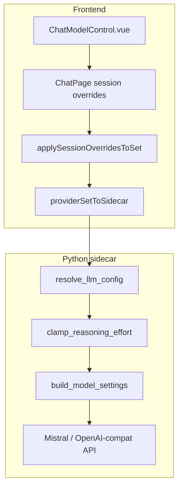

# Provider sets and reasoning effort

> **Last updated:** 20/07/2026  
> **Status:** implemented (catalog-driven UI + backend clamp + Improba Cloud DeviceBearer)

This document describes how Workproba routes LLM models and **reasoning effort** through **provider sets**, how the front and sidecar stay aligned, and how we avoid provider API errors (notably Mistral's `none` / `high`-only models).

## Problem statement

Mistral chat models do not all accept the same `reasoning_effort` values. For example, `mistral-medium-latest` accepts only `none` and `high`. Sending `medium` yields HTTP 400:

```text
reasoning_effort medium is not supported for this model,
supported values: high, none
```

Previously this surfaced as an opaque `INTERNAL_ERROR` in the UI. The fix is **defense in depth**: the UI only offers valid options, the front clamps before send, and the sidecar reclamps before calling the API.

## Design principle: catalog lives in the provider set

Model-specific behaviour (context window, supported reasoning efforts, labels) is declared in **`provider_set.chat.models[]`**, not hard-coded in UI helpers.

| Layer | Source of truth | Fallback when `chat.models` is absent |
|---|---|---|
| Front (set mode) | `providerSet.chat.models[]` | Legacy heuristics in `reasoningSupport.ts` + `modelCatalog.ts` |
| Sidecar (set mode) | Same catalogue on the set in the payload | Legacy heuristics in `app/llm/config.py` |

Builtin sets (`workproba-cloud`, `mistral-default`, `ollama-local`) ship with a full catalogue. Custom sets without a catalogue still work via legacy provider heuristics.

## Builtin sets: Improba Cloud vs Mistral direct

| Set ID | UI name | Badges | `auth_mode` | `isDefault` | Auth at runtime |
|---|---|---|---|---|---|
| `workproba-cloud` | Improba Cloud | Cloud Improba · Recommandé | `device_bearer` | `true` | DeviceBearer from cloud plugin storage |
| `mistral-default` | Mistral | Clé API | `api_key` | `false` | User API key in `set.chat.apiKey` |
| `ollama-local` | Ollama local | 100 % local | (absent) | `false` | None (local) |

**Improba Cloud** routes chat, embeddings, OCR and vision through the control-plane proxy (`{control_plane}/llm/v1`, OpenAI-compatible). No Mistral API key in settings.

**Mistral direct** is a public Mistral API profile: the user supplies their own key. It is not the Improba Cloud subscription.

### DeviceBearer resolution (`device_bearer`)

When `provider_set.auth_mode === "device_bearer"`:

1. The front sends `provider_set` plus `cloud_plugin_data_dir` (path to `{app_data}/plugins/workproba.cloud/`).
2. The sidecar reads the enrolled access token from that directory (`get_access_token`).
3. It resolves `base_url` to `{control_plane}/llm/v1` and injects `Authorization: Bearer <token>`.

Flat `llm_provider_config` / `utility_llm_config` alone are **not** sufficient for cloud sets: `toUtilityLlmConfigFromSet` returns `null` for `device_bearer`; callers must pass the set + `cloud_plugin_data_dir`.

Implementation: `services/ai/app/llm/provider_sets.py` (`resolve_chat_from_set`, `_resolve_device_bearer_token`).

### Schema

**Front** (`useDesktop.types.ts`):

```typescript
interface ProviderSetChatModel {
  model: string;
  label: string;
  hint?: string;
  contextWindow?: number;
  reasoningEfforts?: ReasoningEffort[];  // e.g. ['none', 'high']
}

interface ProviderSetChat {
  provider: LlmProviderName;
  model: string;
  reasoning?: 'auto' | 'none' | 'low' | 'medium' | 'high';
  models?: ProviderSetChatModel[];
  // apiKey, baseUrl, …
}
```

**Sidecar** (`app/schemas.py`): same shape with snake_case (`context_window`, `reasoning_efforts`).

### Mistral builtin catalogue

Duplicated in two files (must stay in sync manually):

| File | Constant |
|---|---|
| `front/src/utils/providerSets.ts` | `MISTRAL_CHAT_MODELS` |
| `services/ai/app/llm/provider_sets.py` | `MISTRAL_CHAT_MODELS` |

| Model | Context | `reasoning_efforts` | UI reasoning menu |
|---|---|---|---|
| `mistral-small-latest` | 256k | `none`, `high` | Aucun · Élevé |
| `mistral-medium-latest` | 256k | `none`, `high` | Aucun · Élevé |
| `mistral-large-latest` | 256k | `none` only | hidden (no adjustable reasoning) |

> **Note:** `capabilities.reasoning: "medium"` on the Mistral preset is a **settings badge** metadata, not the runtime chat reasoning level.

## End-to-end flow



### Agent turn payload (set mode)

When an active provider set exists, the front sends **only** `provider_set` in `/agent/turn` (no `llm_provider_config`). See `aiSidecar.ts`.

Session overrides (model + reasoning per conversation) are baked into the routed set:

1. `buildActiveProviderSet(sessionModel, sessionReasoning)`
2. `applySessionOverridesToSet(baseSet, sessionModel, sessionReasoning)`
3. `providerSetToSidecar(routedSet)`

The sidecar resolves chat config with `resolve_chat_from_set(provider_set)` and builds API settings with:

```python
build_model_settings(config, payload.provider_set)
```

### Legacy mode (no set)

Flat `llm_provider_config` + `embedding_config` are sent. Reasoning is merged via `mergeLlmConfigsWithSessionReasoning` in `llmRouting.ts`.

## Clamping rules

### Front: `providerSetModels.ts`

| Function | Role |
|---|---|
| `supportedReasoningEffortsForSet` | Lists efforts for a model; unknown model in catalogue → `['none']` |
| `supportsReasoningForSet` | `true` when more than one effort is available |
| `clampReasoningEffortForSet` | Maps invalid effort → nearest supported (`medium`/`low` → `high` for Mistral binary models) |
| `defaultReasoningEffortForSet` | Default when set reasoning is `auto` |

**Strict catalogue mode:** if `chat.models` exists but the model id is not listed, reasoning is not adjustable (`['none']` only).

### Front: `applySessionOverridesToSet`

After applying session model override, reasoning is **always reconciled**:

1. Explicit `sessionReasoning` → clamp or force `none` if model does not support reasoning.
2. No session reasoning override, model does not support reasoning → `chat.reasoning = 'none'`.
3. No session override, set has explicit `high`/`medium`/… → reclamp for the effective model.

This prevents stale payloads such as `{ model: mistral-large-latest, reasoning: 'high' }` when only the model changed.

### Sidecar: `clamp_reasoning_effort`

```python
set_efforts = supported_reasoning_efforts_for_set(provider_set, model)
supported = set_efforts if set_efforts is not None else _supported_efforts(provider, model)
```

| Condition | Result |
|---|---|
| `effort` is `none` or absent | `None` (key omitted from API settings) |
| `effort` in supported | unchanged |
| `effort` not in supported, `high` available | `high` |
| otherwise | `None` |

**Mistral heuristic fallback** (no catalogue on payload): only models matching `_mistral_supports_reasoning` accept `none`/`high`; others (e.g. `mistral-large-latest`) accept `none` only.

### Mapping to API

| Provider family | ModelSettings key |
|---|---|
| OpenAI-compat (incl. Mistral, Ollama, vLLM) | `openai_reasoning_effort` |
| Anthropic | `thinking` |

## UI behaviour

**`ChatModelControl.vue`**

- Model list from `modelsForSet(activeSet)`.
- Reasoning section visible only when `supportsReasoningForSet` and more than one effort.
- On model change: reset to `defaultReasoningEffortForSet`; watcher reclamps invalid persisted values.

**`ChatPage.vue`**

- `sessionModelOverride` / `sessionReasoningOverride` persisted per conversation (`workspace-storage.md`).
- On session switch: overrides cleared **immediately** before async load (avoids cross-session leakage).
- Display footer uses `effectiveReasoningEffortFromSet` (respects session model, not only set base model).

## Migration: stored sets without catalogue

Older persisted sets may lack `chat.models`. **`enrichSetFromBuiltin`** injects the builtin catalogue at read time when:

- `set.isBuiltin === true` (matched by `set.id`), and
- `chat.models` is missing or empty.

Called from `resolveSets()` and `normalizeStoredSet()`. Does not rewrite disk until the user saves settings again.

Custom sets (`isBuiltin: false`) without a catalogue keep legacy heuristics.

## Paths that do not send reasoning

| Path | Behaviour |
|---|---|
| Utility title / summary (front) | `toUtilityLlmConfigFromSet` strips `reasoning_effort` |
| Compaction summarize (sidecar) | `chat_config` copied with `reasoning_effort=None` before summarize |
| Memory consolidation | Uses utility config when available |

## Secondary sidecar paths (`cloud_plugin_data_dir`)

These endpoints accept optional `provider_set` and `cloud_plugin_data_dir` (in addition to legacy flat `llm_provider_config` / `utility_llm_config`). When the active set uses `device_bearer`, both fields are required for correct auth:

| Route | Role |
|---|---|
| `POST /llm/sets/test` | Test chat + embeddings for a set |
| `POST /util/title` | Conversation title generation |
| `POST /util/summarize` | Text summarization (session summary, compaction) |
| `POST /memory/promote-session` | Session summary → project memory |
| `POST /plugins/personas/ask` | Regards métier opinion (SSE) |
| `POST /plugins/personas/meeting` | Regards croisés (SSE) |
| `POST /plugins/personas/discuss` | Regards discussion (SSE) |

Personas and utility paths resolve config from `provider_set` and call `build_model_settings(llm_config, provider_set)` so catalogue clamping applies consistently.

## Front fail-closed readiness (`device_bearer`)

Before chat send or Regards métier SSE (`ask` / `meeting` / `discuss`), the front calls `initCloud()` when the active set has `authMode: 'device_bearer'`. Send is blocked if readiness fails (fail-closed).

Readiness issue codes surfaced to the user:

| Code | Typical cause |
|---|---|
| `cloud_not_enrolled` | No device join / missing token |
| `not_subscribed` | Org LLM quota disabled |
| `quota_exceeded` | Monthly token or request cap reached |
| `cloud_unreachable` | Control plane unreachable |
| `org_id_required` | Enrolled but org context missing |

After a successful cloud chat turn, the front calls `refreshQuota()` to update the quota chip.

Implementation: `useChatStream.ts`, `usePersonas.ts`, `useCloud.ts`.

### Cloud auth entry points (desktop)

| Flow | Endpoint / surface | Token | Entry points |
|---|---|---|---|
| Account login | `POST {control_plane}/devices/login` (username/password) | User JWT | `CloudLoginModal`, `EngineOnboardingWizard`, Settings |
| Device enroll | `POST {control_plane}/devices/join` (`join_token`) | DeviceBearer (`wp_dev_*`) | `EnrollCloudModal`, `EnrollCloudJoinForm`, CloudPanel, model settings |

`device_bearer` provider sets require a DeviceBearer from enroll, not a User JWT alone. `cloudDesktopAuth.ts` handles login; `cloudWebUrls.ts` builds cloud web login/register URLs (`VITE_CLOUD_WEB_URL`, default `http://localhost:8482`).

## Known limitations / residual risks

1. **Dual catalogue** — front and back catalogues must be updated together (+ tests).
2. **Rust settings store** — `ProviderSetChatEntry` in `desktop/src-tauri/.../settings_store.rs` does not persist `models`; enrichment happens on the front at load time.
3. **Stale partial catalogue** — enrichment only runs when `models` is entirely absent, not when entries lack new fields.
4. **Custom sets** — no automatic catalogue merge; rely on legacy heuristics or manual `models` definition.
5. **Sidecar restart** — backend changes require restarting the AI sidecar during dev.

## File reference

### Frontend

| File | Role |
|---|---|
| `front/src/utils/providerSets.ts` | Builtin sets, `applySessionOverridesToSet`, `enrichSetFromBuiltin`, `providerSetToSidecar` |
| `front/src/utils/providerSetModels.ts` | Catalogue helpers (support, clamp, context window) |
| `front/src/utils/llmRouting.ts` | Session-aware flat config merge (legacy) |
| `front/src/utils/reasoningSupport.ts` | Legacy provider heuristics |
| `front/src/components/chat/ChatModelControl.vue` | Composer model + reasoning UI |
| `front/src/pages/chat/ChatPage.vue` | Session overrides, persistence, display |
| `front/src/composables/useChatStream.ts` | Agent turn payload assembly |
| `front/src/services/aiSidecar.ts` | Payload shape (`provider_set` vs `llm_provider_config`) |

### Sidecar

| File | Role |
|---|---|
| `services/ai/app/llm/provider_sets.py` | Builtin sets, `supported_reasoning_efforts_for_set` |
| `services/ai/app/llm/config.py` | `clamp_reasoning_effort`, `build_model_settings` |
| `services/ai/app/schemas.py` | `ProviderSetChatModel`, `ProviderSet` |
| `services/ai/app/main.py` | Agent turn: `build_model_settings(config, provider_set)` |
| `services/ai/app/agent/compaction.py` | Summarize without reasoning effort |
| `services/ai/app/plugins/workproba_personas/orchestrator.py` | Personas with provider_set clamp |

## Tests

### Frontend (Vitest)

```bash
cd front
npx vitest run test/unit/utils/providerSetModels.spec.ts \
  test/unit/utils/providerSetsEnrich.spec.ts \
  test/unit/utils/llmRouting.spec.ts \
  test/unit/utils/reasoningSupport.spec.ts \
  test/unit/services/aiSidecar.spec.ts
```

Covers: catalogue efforts, unknown model → `none`, `enrichSetFromBuiltin`, medium→high clamp, large without reasoning, set-only sidecar payload.

### Sidecar (pytest)

```bash
cd services/ai
.venv/bin/pytest tests/test_provider_sets.py tests/test_llm_config.py tests/test_compaction.py -q
```

Shared JSON fixture for the front ↔ sidecar contract:

| File | Role |
|---|---|
| `services/ai/tests/fixtures/mistral_builtin_sidecar.json` | Canonical `providerSetToSidecar(MISTRAL_BUILTIN_SET)` payload |
| `front/test/unit/utils/providerSetsSerialization.spec.ts` | Round-trip + fixture parse (Vitest) |
| `tests/test_provider_sets.py::test_provider_set_from_front_sidecar_fixture` | Pydantic validation of the same fixture |

Covers: builtin catalogue, `supported_reasoning_efforts_for_set`, provider_set-aware `build_model_settings`, Mistral large heuristic without set.

## Manual verification checklist

After changing catalogue or clamp logic (restart sidecar in dev):

1. **Mistral Medium + Élevé** — message sends successfully, no `INTERNAL_ERROR`.
2. **Mistral Medium** — reasoning menu shows only **Aucun** and **Élevé** (not Moyen/Faible).
3. **Mistral Large** — no reasoning section in composer.
4. **Session with legacy `medium`** — clamped to `high` or `none` on load/send.
5. **Switch session A → B quickly** — no message sent with A's model/reasoning in B.
6. **Set default `high` on Small, session model Large** — payload has `reasoning: 'none'`.

## Adding a new model to a set

1. Add entry to `MISTRAL_CHAT_MODELS` (or relevant set) in **both**:
   - `front/src/utils/providerSets.ts`
   - `services/ai/app/llm/provider_sets.py`
2. Set accurate `reasoning_efforts` per provider API docs.
3. Add/adjust unit tests in both front and back.
4. Verify UI labels and context window hints.
5. Run manual checklist above.

## Related docs

- [architecture.md § Model and reasoning per conversation](./architecture.md#model-and-reasoning-per-conversation)
- [workspace-storage.md § Session fields](./workspace-storage.md) (`model`, `reasoningEffort`)
- [testing.md](./testing.md)
- [services/ai/README.md](../services/ai/README.md)
